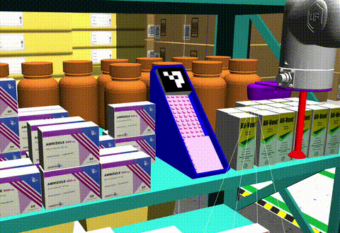
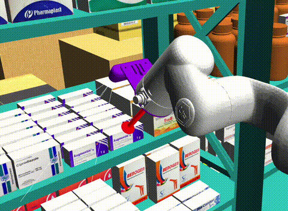
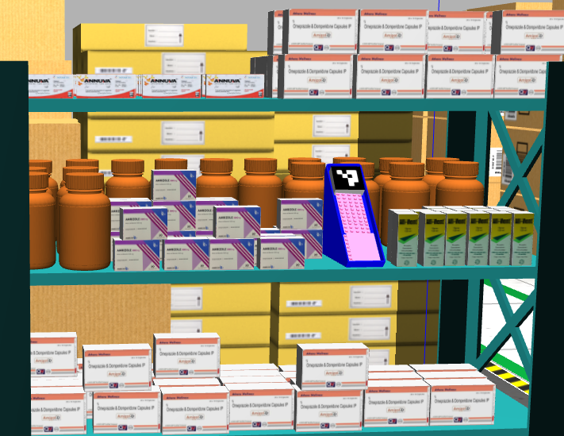
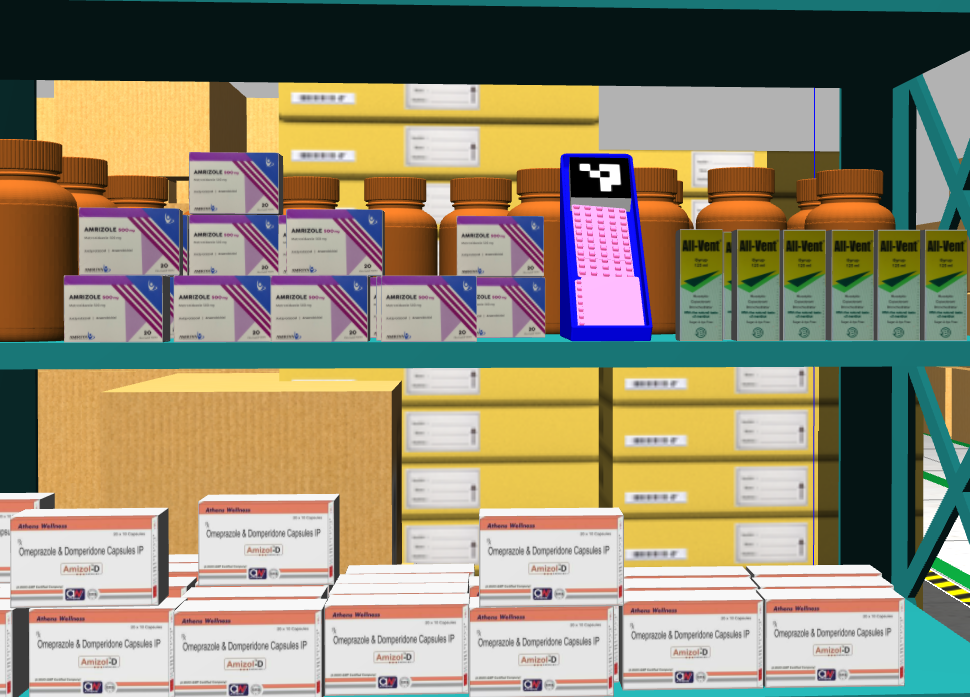
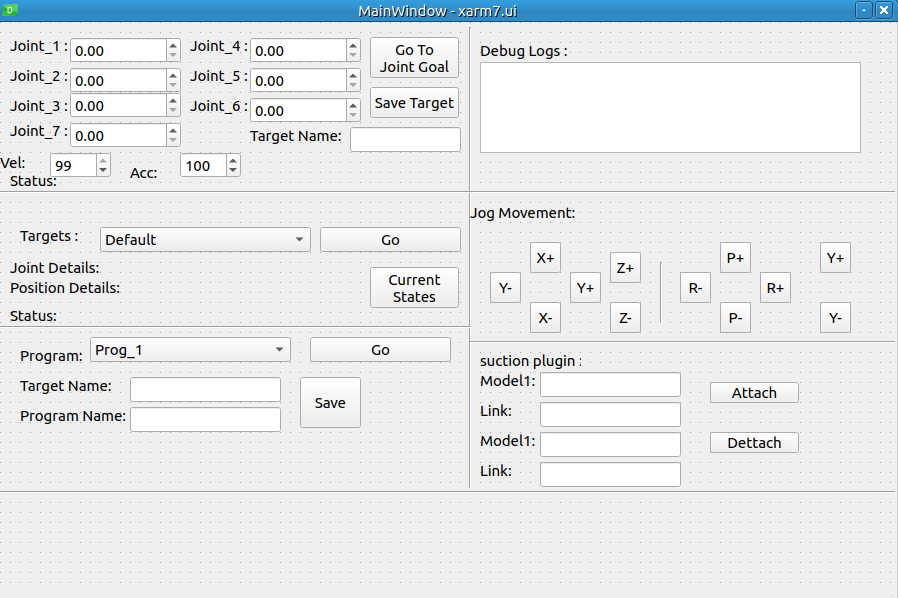

# Robotic Arm Industry Automation

**Automated Medicine Pick & Place with xArm7 + Custom GUI**






## Overview

This project simulates an **automated industrial robotic arm system** for medicine handling.
It uses a **customized xArm7 robotic arm** integrated with:

* **Gazebo 11** for simulation
* **MoveIt 2** for motion planning
* **ArUco marker detection** for object localization
* **Custom GUI** for user control
* **Custom vacuum gripper** for picking medicine bottles

---

## Key Features

* 🚀 **Pick and Place Automation**:
  Robotic arm picks medicine bottles and places them into racks.

* 🧪 **Custom Medicine Bottles**:
  Custom 3D models of medicine bottles included in simulation.

* 🎧 **Custom GUI Panel**:

  * **Save Pose**
  * **Go to Target Pose**
  * **Program Mode**: Sequence of movements
  * **Run Program**
  * **Separate Suction GUI** for vacuum control

* �� **Vacuum Gripper**:
  Custom suction-based gripper for precise object handling.

* ⚡ **Fast DDS**:
  Uses Fast DDS for ROS 2 communication (recommended).

---

## Project Structure

```
robotic_arm_industry/
├── xarm7_bringup/launch/xarm7_bringup.launch.py   # Main launch file
├── media/                                         # GIFs and screenshots
├── meshes/                                        # Custom medicine bottles
├── urdf/                                          # Robot URDF with vacuum gripper
├── src/gui_control/                              # Custom GUI code
└── config/moveit_config/                         # MoveIt 2 config
```

---

## Installation

### 1️⃣ Prerequisites

* **ROS 2 Humble**
* **Gazebo 11**
* **MoveIt 2**
* **xArm SDK & ROS Packages**
* **Fast DDS**

---

### 2️⃣ Clone the repository

```bash
git clone https://github.com/syedazif321/robotic_arm_industry.git
cd robotic_arm_industry
```

---

### 3️⃣ Install dependencies

```bash
sudo apt update
rosdep install --from-paths src --ignore-src -r -y
```

---

### 4️⃣ Build the workspace

```bash
colcon build --symlink-install
source install/setup.bash
```

---

## Running the Simulation

### Launch the System

```bash
ros2 launch xarm7_bringup xarm7_bringup.launch.py
```

This will:

* Start Gazebo with xArm7 + suction gripper
* Load MoveIt 2 motion planning
* Open the custom GUI for control

---

## Custom GUI Controls

| Function              | Description                    |
| --------------------- | ------------------------------ |
| **Save Pose**         | Save current robot pose        |
| **Go to Target Pose** | Move to saved pose             |
| **Program Mode**      | Sequence creation              |
| **Run Program**       | Execute saved sequence         |
| **Suction Control**   | Separate GUI to toggle suction |

---

## Media

|     GUI & Simulation Example     |
| :------------------------------: |
|  |

---

## Future Work

* Hardware integration with real xArm7
* Conveyor belt & multiple station handling
* Advanced perception (YOLO/OpenCV extension)

---

## License

This project is under the **MIT License**.

---

## Acknowledgments

Based on **xArm ROS packages**, and **MoveIt 2** frameworks.
